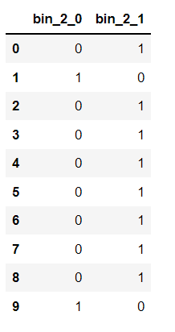
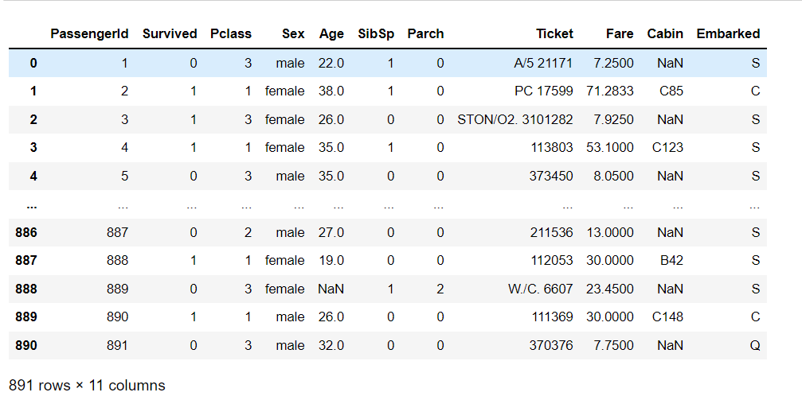
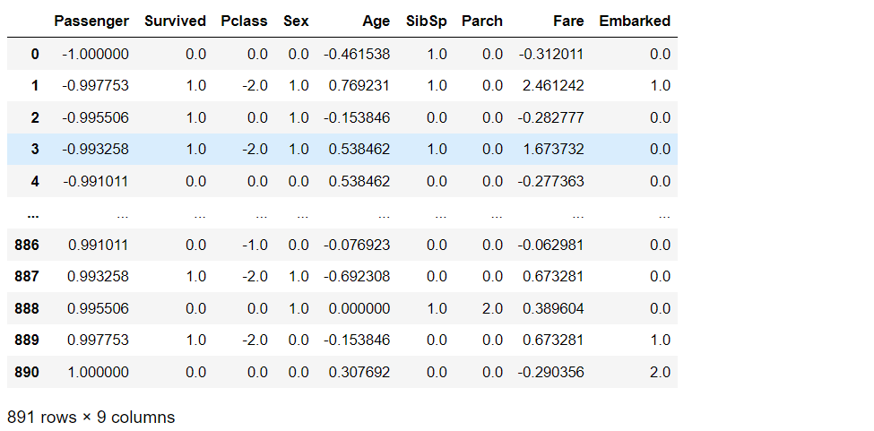

# EX-05-Feature-Generation


## AIM
To read the given data and perform Feature Generation process and save the data to a file. 

# Explanation
Feature Generation (also known as feature construction, feature extraction or feature engineering) is the process of transforming features into new features that better relate to the target.
 

# ALGORITHM
### STEP 1
Read the given Data
### STEP 2
Clean the Data Set using Data Cleaning Process
### STEP 3
Apply Feature Generation techniques to all the feature of the data set
### STEP 4
Save the data to the file


# CODE
```
Developed By: K.Balaji
Register No: 212221230011
```
# Dataset 1 - Data.csv
## Code:
```
import pandas as pd
df=pd.read_csv("data.csv")
df
from sklearn.preprocessing import LabelEncoder, OrdinalEncoder
oe=OrdinalEncoder()
oe.fit_transform(df[["Ord_1"]])
temp=['Cold','Warm','Hot','Very Hot']
enc=OrdinalEncoder(categories=[temp])
enc
enc.fit_transform(df[['Ord_1']])
df1=df.copy()
df1["Ord_1"]=enc.fit_transform(df[["Ord_1"]])
df1
oe1=OrdinalEncoder()
oe.fit_transform(df[["Ord_2"]])
studies=['High School','Diploma','Bachelors','Masters','PhD']
enc1=OrdinalEncoder(categories=[studies])
enc1
enc1.fit_transform(df[['Ord_2']])
df2=df1.copy()
df2["Ord_2"]=enc1.fit_transform(df[["Ord_2"]])
df2
pip install category_encoders
from category_encoders import BinaryEncoder
be=BinaryEncoder()
newdata=be.fit_transform(df2["bin_1"])
newdata
df3=df2.copy()
df3["bin_1"]=be.fit_transform(df[["bin_1"]])
df3
be1=BinaryEncoder()
newdata2=be1.fit_transform(df3['bin_2'])
newdata2
df4=df3.copy()
df4["bin_2"]=be1.fit_transform(df[["bin_2"]])
df4
from sklearn.preprocessing import OneHotEncoder
ohe=OneHotEncoder(sparse=False)
ohe.fit_transform(df4[['City']])
num=ohe.fit_transform(df4[['City']])
num
df4
from sklearn.preprocessing import LabelEncoder, OrdinalEncoder
le=LabelEncoder()
le.fit_transform(df4[['City']])
df5=df4.copy()
df5["City"]=le.fit_transform(df4[['City']])
df5

from sklearn.preprocessing import MinMaxScaler
scaler=MinMaxScaler()
df6=pd.DataFrame(scaler.fit_transform(df5),columns=['id', 'bin_1', 'bin_2', 'City', 'Ord_1','Ord_2','Target'])
df6

from sklearn.preprocessing import StandardScaler
Stdscaler=StandardScaler()
df7=pd.DataFrame(Stdscaler.fit_transform(df5),columns=['id', 'bin_1', 'bin_2', 'City', 'Ord_1','Ord_2','Target'])
df7

from sklearn.preprocessing import MaxAbsScaler
maxabsscaler=MaxAbsScaler()
df8=pd.DataFrame(maxabsscaler.fit_transform(df5),columns=['id', 'bin_1', 'bin_2', 'City', 'Ord_1','Ord_2','Target'])
df8

from sklearn.preprocessing import RobustScaler
rscaler = RobustScaler()
df9=pd.DataFrame(rscaler.fit_transform(df5),columns=['id', 'bin_1', 'bin_2', 'City', 'Ord_1','Ord_2','Target'])
df9
```
# OUTPUT
## DataFrame(data.csv):

## Applying Ordinal Encoding Method in column- Ord_1:


## After applying Ordinal Encoding Method in column- Ord_1:

## Applying Ordinal Encoding Method in column- Ord_2:


## After applying Ordinal Encoding Method in column- Ord_2:

## Applying Binary Encoding Method in column- bin_1:

## After Binary Encoding Method in column- bin_1:

## Applying Binary Encoding Method in column- bin_2:

## After Binary Encoding Method in column- bin_2:

## One Hot Encoding Method:


## Final DataSet after applying Encoding Methods:

## Feature Scaling Techniques:
Feature scaling is a method used to normalize the range of independent variables or features of data. In data processing, it is also known as data normalization and is generally performed during the data preprocessing step.

    1.Min-Max Scaler.
    2.Standard Scaler.
    3.Max Abs Scaler.
    4.Robust Scaler.
## Feature Scaling - Min-Max Scaler Technique:

## Feature Scaling - Standard Scaler Technique:

## Feature Scaling - Max Abs Scaler Technique:

## Feature Scaling - Robust Scaler Technique:


# Dataset 2 - Encoding Data.csv
## Code:
```
import pandas as pd
df=pd.read_csv("Encoding Data.csv")
df
from sklearn.preprocessing import LabelEncoder, OrdinalEncoder
oe=OrdinalEncoder()
oe.fit_transform(df[["ord_2"]])
temp=['Cold','Warm','Hot']
enc=OrdinalEncoder(categories=[temp])
enc
enc.fit_transform(df[['ord_2']])
df1=df.copy()
df1["ord_2"]=enc.fit_transform(df[["ord_2"]])
df1
oe1=OrdinalEncoder()
oe.fit_transform(df[["nom_0"]])
color=['Green','Blue','Red']
enc1=OrdinalEncoder(categories=[color])
enc1
enc1.fit_transform(df[['nom_0']])
df2=df1.copy()
df2["nom_0"]=enc1.fit_transform(df[["nom_0"]])
df2
pip install category_encoders
from category_encoders import BinaryEncoder
be=BinaryEncoder()
newdata=be.fit_transform(df2["bin_1"])
newdata
df3=df2.copy()
df3["bin_1"]=be.fit_transform(df[["bin_1"]])
df3
be1=BinaryEncoder()
newdata2=be1.fit_transform(df3['bin_2'])
newdata2
df4=df3.copy()
df4["bin_2"]=be1.fit_transform(df[["bin_2"]])
df4

from sklearn.preprocessing import MinMaxScaler
scaler=MinMaxScaler()
df5=pd.DataFrame(scaler.fit_transform(df4),columns=['id', 'bin_1', 'bin_2', 'nom_0','ord_2'])
df5

from sklearn.preprocessing import StandardScaler
Stdscaler=StandardScaler()
df6=pd.DataFrame(Stdscaler.fit_transform(df4),columns=['id', 'bin_1', 'bin_2', 'nom_0','ord_2'])
df6

from sklearn.preprocessing import MaxAbsScaler
maxabsscaler=MaxAbsScaler()
df7=pd.DataFrame(maxabsscaler.fit_transform(df4),columns=['id', 'bin_1', 'bin_2', 'nom_0','ord_2'])
df7

from sklearn.preprocessing import RobustScaler
rscaler = RobustScaler()
df8=pd.DataFrame(rscaler.fit_transform(df4),columns=['id', 'bin_1', 'bin_2', 'nom_0','ord_2'])
df8
```

# Output:
## DataFrame (Encoding Data.csv)

## Applying Ordinal Encoding Method in column - ord_2:


## After applying Ordinal Encoding Method in column - ord_2:

## Applying Ordinal Encoding Method in column - nom_0:


## After applying Ordinal Encoding Method in column - nom_0:

## Applying Binary Encoding Method in column - bin_1:

## After applying Binary Encoding in column- bin_1:

## Applying Binary Encoding Method in column - bin_2:

## After applying Binary Encoding in column- bin_2:

## Final DataSet after applying Encoding Methods:

## Feature Scaling Techniques:
    1.Min-Max Scaler.
    2.Standard Scaler.
    3.Max Abs Scaler.
    4.Robust Scaler.
## Feature Scaling - Min-Max Scaler Technique:

## Feature Scaling - Standard Scaler Technique:

## Feature Scaling - Max Abs Scaler Technique:

## Feature Scaling - Robust Scaler Technique:


# Dataset 3 - titanic_dataset.csv
## Code:
```
import pandas as pd
df=pd.read_csv("titanic_dataset.csv")
df
df.drop("Name",axis=1,inplace=True)
df
df.drop("Cabin",axis=1,inplace=True)
df
df.drop("Ticket",axis=1,inplace=True)
df
df.info()
df.isnull().sum()
df["Age"]=df["Age"].fillna(df["Age"].median())
df["Embarked"]=df["Embarked"].fillna(df["Embarked"].mode()[0])
df.boxplot()
df.isnull().sum()
df

from sklearn.preprocessing import LabelEncoder, OrdinalEncoder
oe=OrdinalEncoder()
oe.fit_transform(df[["Embarked"]])
embark=['S','C','Q']
enc=OrdinalEncoder(categories=[embark])
enc
enc.fit_transform(df[['Embarked']])
df1=df.copy()
df1["Embarked"]=enc.fit_transform(df[["Embarked"]])
df1
pip install category_encoders
from category_encoders import BinaryEncoder
be=BinaryEncoder()
newdata=be.fit_transform(df1["Sex"])
newdata
df2=df1.copy()
df2["Sex"]=be.fit_transform(df1[["Sex"]])
df2

from sklearn.preprocessing import MinMaxScaler
scaler=MinMaxScaler()
df3=pd.DataFrame(scaler.fit_transform(df2),columns=['Passenger','Survived','Pclass','Sex','Age','SibSp','Parch','Fare','Embarked'])
df3

from sklearn.preprocessing import StandardScaler
Stdscaler=StandardScaler()
df4=pd.DataFrame(Stdscaler.fit_transform(df2),columns=['Passenger','Survived','Pclass','Sex','Age','SibSp','Parch','Fare','Embarked'])
df4

from sklearn.preprocessing import MaxAbsScaler
maxabsscaler=MaxAbsScaler()
df5=pd.DataFrame(maxabsscaler.fit_transform(df2),columns=['Passenger','Survived','Pclass','Sex','Age','SibSp','Parch','Fare','Embarked'])
df5

from sklearn.preprocessing import RobustScaler
rscaler = RobustScaler()
df6=pd.DataFrame(rscaler.fit_transform(df2),columns=['Passenger','Survived','Pclass','Sex','Age','SibSp','Parch','Fare','Embarked'])
df6
```

# Output:
## DataFrame - (titanic_dataset.csv):

## Droping "Name" column from DataFrame:

## Droping "Cabin" and "Ticket" column from DataFrame:

## Non Null-data Count:

## Sum of null data present in each column:

## Handling Null data in Column "Age" and "Embarked" :

## Data Frame after removing column - Age,Cabin,Ticket:

## Feature Generation Process:
    1.Ordinal Encoder.
    2.Binary Encoder.
    3.One Hot Encoder.
## Applying Ordinal Encoding Method in column - Embarked:


## After applying Ordinal Encoding Method in column - Embarked:

## Applying Binary Encoding Method in column - Sex:

## After applying Binary Encoding in column- Sex:

## Feature Scaling Techniques:
    1.Min-Max Scaler.
    2.Standard Scaler.
    3.Max Abs Scaler.
    4.Robust Scaler.
## Feature Scaling - Min-Max Scaler Technique:

## Feature Scaling - Standard Scaler Technique:

## Feature Scaling - Max Abs Scaler Technique:

## Feature Scaling - Robust Scaler Technique:

# Result:
Feature Generation process and Feature Scaling process is applied to the given data frame sucessfully.